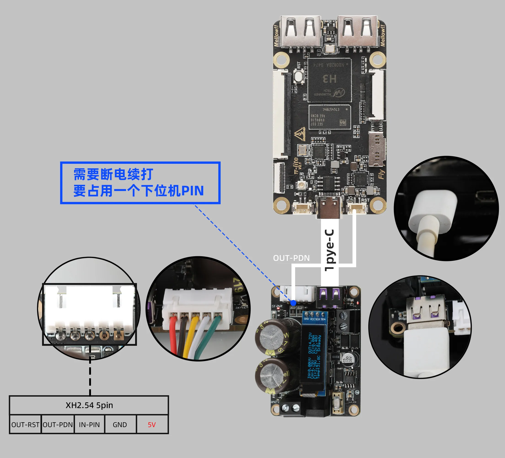

## Product Introduction

The FLY-KPPM installation shutdown module is specifically designed for development boards like Raspberry Pi to ensure data security. It prevents data loss caused by power outages. With advanced technology, when a power outage occurs, it automatically switches to capacitor power, ensuring the development board can still operate stably for 15 seconds during the power failure, guaranteeing effective data preservation. Compact and convenient, it is easy to install.


## Notes

> Note
>
> Input power only supports DC12-24V. Pay attention to distinguish the positive and negative poles when wiring. The wiring must be performed with the power off. Only after confirming the wiring is correct can power be applied; we are not liable for any losses caused by incorrect wiring.

> Note
> The +5V on the 5V OUT socket is for emergency power output only and should not be used for regular power supply. Please use USB-OUT or SIG/IO to power the host computer.

> Note
> When using the safe shutdown module, a 12V-24V power supply is required. To ensure the module operates normally, the 5V output voltage on the safe shutdown module board must not be lower than 4.9V. Otherwise, the safe shutdown module will draw power from internal boosting, causing the capacitor to remain in a charging state continuously, leading to continuous heating of the module.

## Screen Display Description


| Screen Description | Left Description                 | Right Parameter | Right Description        |
| -------------------- | ---------------------------------- | ----------------- | -------------------------- |
| `IN:`              | Input Voltage                    | `OUT:`          | Output Voltage           |
| `CA:`              | Total Capacitor Voltage          | `OI:`           | Output Load Current      |
| `C1:`              | C1 Capacitor Voltage             | `C2:`           | C2 Capacitor Voltage     |
| `Temp:`            | Safe Shutdown Module Temperature | `E:`            | Status Prompt, see below |


| Display Content | Status Description                                                                                                                                   |
| ----------------- | ------------------------------------------------------------------------------------------------------------------------------------------------------ |
| `Ready!`        | Normal Startup                                                                                                                                       |
| `IN LOW!`       | Input Voltage Low                                                                                                                                    |
| `IN OVR!`       | Output Current Too High                                                                                                                              |
| `OV LOE!`       | Output Voltage Too Low                                                                                                                               |
| `OV OVR`        | Output Current Too High                                                                                                                              |
| `TP OVR!`       | Temperature Too High                                                                                                                                 |
| `NONE`          | Unknown Error                                                                                                                                        |
| `R: XX Sec`     | This prompt will be displayed if power is cut and restored within 10 seconds. The host computer will automatically restart after the countdown ends. |

## Fixed Shell Model Download

```bash codeBlock_bY9V thin-scrollbar
https://cdn.mellow.klipper.cn/STEP/KPPM.zip
```

## Pin Description

* OUT-RST Reset
* OUT-PDN Shutdown
* IN-PIN
  Default pulled high, the module automatically detects the last power-down time when powered on. If the power-down duration is less than 10 seconds, it will wait until 10 seconds have passed before automatically switching the 5V output once (ensuring the host computer completes shutdown and can restart again). If connected to GND, the automatic detection of power-down time will be disabled.


## FLY Host Computer Usage Tutorial

> info
> Applicable only to FLY-Pi, FLY-Pi-V2, FLY-C8 FAST system comes pre-installed, no installation required

You need to use SSH to execute the following commands on the FLY host computer:

```plaintext
sudo curl -kfSL --progress-bar https://cnb.cool/3dmellow/public/static-files/-/git/raw/main/host/sun50i-h5-power-key.dtbo -o /boot/dtb/allwinner/overlay/sun50i-h5-power-key.dtbo
sudo grep -q "^overlays=.*power-key" /boot/FlyOS-Env.txt || sudo sed -i '/^overlays=/ s/$/ power-key/' /boot/FlyOS-Env.txt
```

```
sudo curl -kfSL --progress-bar https://cdn.mellow.klipper.cn/firmware/sun50i-h5-power-key.dtbo -o /boot/dtb/allwinner/overlay/sun50i-h5-power-key.dtbo
sudo grep -q "^overlays=.*power-key" /boot/FlyOS-Env.txt || sudo sed -i '/^overlays=/ s/$/ power-key/' /boot/FlyOS-Env.txt
```

Restart the system:

```plaintext
sudo reboot
```

### FLY Host Computer Wiring Tutorial

* FLY-C8 V1.2 Wiring



## Raspberry Pi Host Computer Usage Tutorial

The Raspberry Pi operation is similar to the above. For Raspberry Pi, insert the SD card with the system image into the computer, and add the line `dtoverlay=gpio-shutdown,gpio_pin=21` to the config.txt file, then save and exit.


* Raspberry Pi Using 5V Wiring
* Raspberry Pi Using USB Wiring
* Raspberry Pi using 5V wiring


