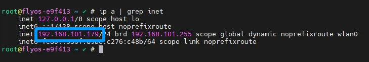
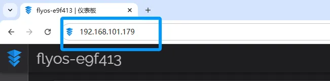
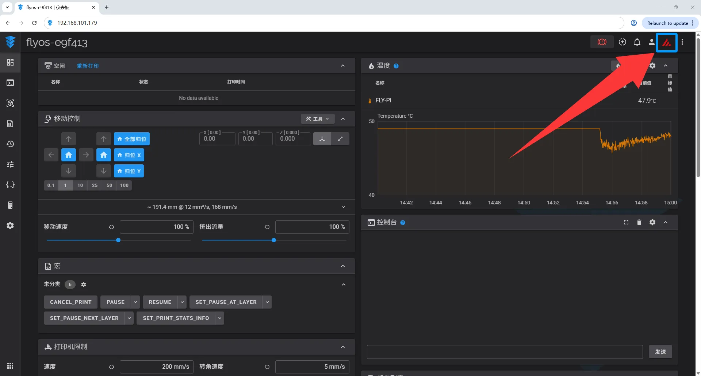
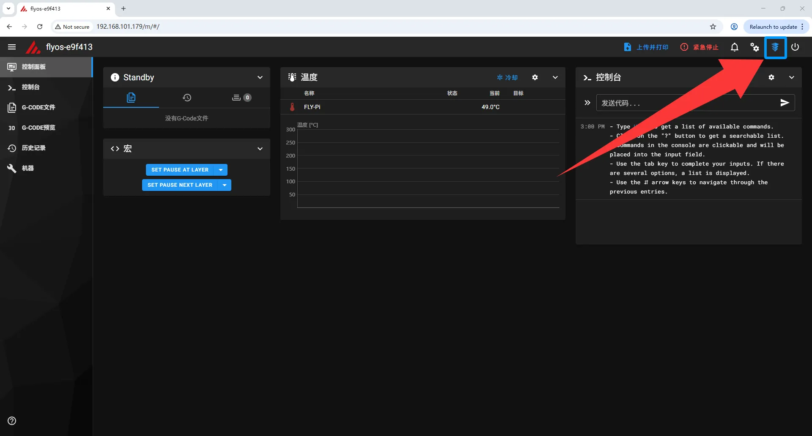
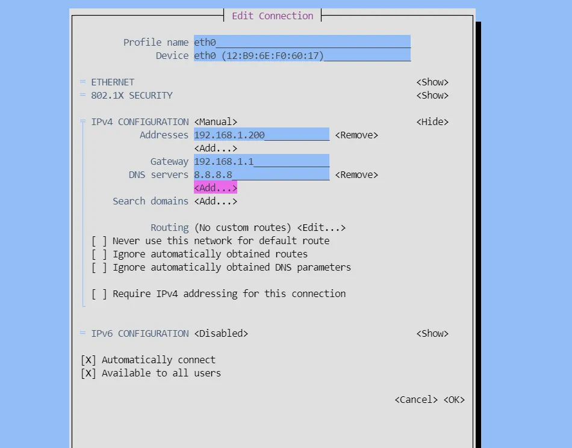

# Connect to Wi-Fi

## FLYOS-FAST System Wi-Fi Connection Guide

### Preparations

Ensure your Wi-Fi module is correctly installed on the host computer and that your router is functioning properly.

### Connection Steps

#### Step 1: Start the Network Management Tool

1. Connect to your FAST system host via SSH.
2. Enter the following command in the terminal and press `Enter`:
   ```plaintext
   nmtui
   ```
3. The system will display the network management tool interface:
   
   

#### Step 2: Select Connection Operation

Operation Instructions for the WiFi Configuration Page

* Please ensure that the keyboard input method is in half-width mode, i.e., English mode.
* The up key`↑` and down key`↓` on the keyboard are used to move the cursor up and down to select menu items.
* The confirm key`Enter` is used to check the menu or enter a sub-menu.
* The exit key`ESC` is used to return to the previous menu.

1. Use the keyboard arrow keys to select**"Activate a connection"** .
2. Press `Enter` to proceed to the next step:
   

#### Step 3: View Available Networks

Enter the connection management interface:


#### Step 4: Select Wi-Fi Network

1. The system will automatically scan and list available Wi-Fi networks.
2. Use the arrow keys to select the network you want to connect to:
   
   Important Notes
   * **Chinese SSID Not Supported** : Ensure your Wi-Fi name (SSID)**does not contain Chinese characters** .
   * **Band Support** :
     * All modules support 2.4G Wi-Fi.
     * 5G Wi-Fi support depends on the module model (FLY-M2WE supports 5G).
   * **Signal Strength** : The number of`*` symbols after the Wi-Fi name indicates signal strength (more`*` means stronger signal).

#### Step 5: Enter Wi-Fi Password

1. Press`Enter` to select the target network.
2. In the pop-up password input box, accurately enter your Wi-Fi password:
   
3. Press `Enter` to confirm the connection:
   

#### Step 6: Confirm Connection Status

After a successful connection, the system will return to the network list interface:

* A `*` mark will appear in front of the connected Wi-Fi:
  
* Press `Esc` twice to return to the main menu:
  

#### Step 7: Obtain Device IP Address

1. After returning to the terminal, enter the following command to get network configuration:
   ```plaintext
   ip a | grep inet
   ```
2. Look for an IP address similar to `192.168.x.x` or `10.x.x.x`:
   
   Quick Identification
   Usually, the `inet` address under the `wlan0` or similar interface is your Wi-Fi IP address.

#### Step 8: Access Web Console

1. Open a browser (Chrome, Edge, Firefox, etc.).
2. Enter the IP address obtained in Step 7 into the address bar (e.g.,`http://192.168.1.179`).
3. Press `Enter` to access the FLYOS-FAST Web Console:
   

### Advanced Features

#### Web Interface Switching

FLYOS-FAST supports seamless switching between Mainsail and Fluidd:

1. Click the**Mainsail/Fluidd icon** in the upper right corner of the Web Console.
2. The system will automatically switch to the other interface without requiring re-login:
   **Switch to Mainsail** :
   
   **Switch to Fluidd** :
   

Connection Success Tips

* **First-time Connection** : It is recommended to use an Ethernet cable for initial configuration, then switch to Wi-Fi.
* **Configuration Saving** : Successfully connected Wi-Fi configurations are automatically saved and will reconnect after a reboot.
* **Multi-Network Environment** : If both Ethernet cable and Wi-Fi are connected, the system will prioritize the wired network.

## Troubleshooting

### Common Issues


| Issue                 | Possible Causes                                                                               | Solutions                                                                                       |
| ----------------------- | ----------------------------------------------------------------------------------------------- | ------------------------------------------------------------------------------------------------- |
| Cannot see Wi-Fi list | 1. Module not connected correctly<br/>2. Router is too far away<br/>3. Driver incompatibility | 1. Check module connection<br/>2. Move closer to the router<br/>3. Try other compatible modules |
| Connection failure    | 1. Incorrect password<br/>2. Router restrictions<br/>3. Band mismatch                         | 1. Confirm password is correct<br/>2. Check router MAC filtering<br/>3. Try the 2.4G band       |
| Cannot obtain IP      | 1. DHCP service issue<br/>2. Signal too weak                                                  | 1. Restart the router<br/>2. Use static IP configuration                                        |

### List of Supported Wireless Modules

The following are wireless network modules officially tested and supported by the FLYOS-FAST system:


| Module Type                                | Series/Model                                                                                                                | Supported Bands           | Antenna Interface         | Notes                                                            |
| -------------------------------------------- | ----------------------------------------------------------------------------------------------------------------------------- | --------------------------- | --------------------------- | ------------------------------------------------------------------ |
| **FLY Official Modules**                   | **FLY-M2WE**                                                                                                                | 2.4G/5G Dual-band         | IPEX-1                    | **Recommended for use** , stable performance, best compatibility |
|                                            | **FLY-2.4GWiFi**                                                                                                            | 2.4G Band                 | IPEX-1                    | Suitable for environments requiring only 2.4G connection         |
| **Third-party **<br/>**USB Wi-Fi Modules** | **AIC Series**<br/>AIC8800DL / DC / D40 / D80 / D80x2                                                                       | Depends on specific model | Depends on specific model | Drivers pre-installed in system, plug and play                   |
|                                            | **MTK (MediaTek) Series**<br/>MT7601U / MT76X0U / MT76X2U / MT7663U                                                         | Depends on specific model | Depends on specific model | Drivers pre-installed in system, plug and play                   |
|                                            | **Realtek Series**<br/>RT61 / RT73 / RT2XX series<br/>RTL81XX / 87XX / 88XX series<br/>RTW88 / 89 series<br/>RTL815X series | Depends on specific model | Depends on specific model | Drivers pre-installed in system, plug and play                   |

Usage Suggestions

1. **It is recommended to prioritize using FLY official modules** to ensure optimal compatibility and stability.
2. **Drivers for the above chipsets are pre-installed in the system** , no additional configuration is needed.
3. **5G Wi-Fi support** depends on the module's hardware capabilities; please refer to specific product specifications.
4. **Antenna Connection** : FLY official modules use the IPEX-1 interface; ensure you use a matching antenna.

### Static IP Configuration (Optional)

* If you need to configure a static IP, you can select "Edit a connection" in`nmtui` for advanced settings.
* Reference is provided below.
  
