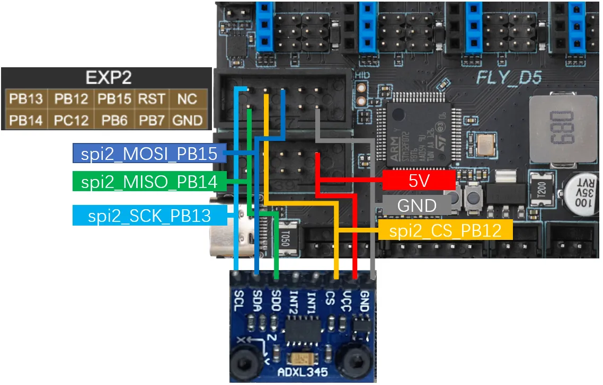

# ADXL345

## Wire ​

*   The accelerometer links are shown in the following figure:



## Reference configuration ​

```
[adxl345]
cs_pin: PB12
spi_bus: spi2 				  # Choose one of hard SPI, hard SPI and soft SPI. Default hard SPI
# spi_software_mosi_pin: PB15 # Choose one of soft SPI, hard SPI and soft SPI. Default hard SPI
# spi_software_miso_pin: PB14
# spi_software_sclk_pin: PB13

[resonance_tester]
accel_chip: adxl345
#accel_chip_y: adxl345 bed
probe_points:
    100, 100, 20   			  # Generally, it is in the middle of the hot bed, please modify it according to the actual situation of your machine
```

## Use of Tutorials ​

## Dependent package installation ​

Attention

**Considerations**

*   If your device is already running **a FlyOS-FAST system**, **you can skip this step** by pre-installing **the** required dependencies.
*   If **you** are using **a non-FLY on-premises machine**, be sure to complete the installation operation below.
*   It is recommended to connect with SSH tools such as MobaXterm, PuTTY, etc.

### Installation steps ​

1.  Run the following command to install the dependency package.
2.  The installation time depends on the CPU performance and network conditions, usually **takes 10-20 minutes**, please wait patiently until the installation is complete.
3.  If the device memory (RAM) is too small, it may cause the installation to fail.

Installation system depends:

```
sudo apt install python3-numpy python3-matplotlib libatlas-base-dev
```

Installing the Klipper virtual environment depends on:

```
~/klippy-env/bin/pip install matplotlib numpy
```

---

## Accelerometer test ​

### Preconditions ​

*   The printer has performed **the Homing** operation.
*   Ensure that the accelerometer is enabled correctly in the Klipper configuration file.

### Test instructions ​

Enter the following command in the Klipper console:

```
ACCELEROMETER_QUERY
```

If multiple accelerometers are connected, the chip can be specified for testing:

```
ACCELEROMETER_QUERY CHIP=<ADXL chip name>
```

Please `<ADXL芯片名称>`Replaced by the actual accelerometer identifier (e.g. `adxl345`).

### Frequently Asked Questions ​

1.  **First execution failed** : Some Klipper versions may **have** command recognition delays, and if the first execution does not return data, **re-execute** the same command **once.**
2.  \*\*The command is not recognized.\*\*If you execute the unknown command many times, it may be caused by the low Klipper version, it is recommended:
    *   Update Klipper to the latest version
    *   Or re-write the latest version of the system (such as the latest version of FlyOS-FAST)

### The result of judgment ​

*   **Normal output** : Resonance compensation measurements can be made if the return of a continuous data flow (shown below), indicating that the accelerometer is working properly.
*   **Error output**If you are prompted for a timeout, no data or communication error, check:
    1.  Is the accelerometer cable strong?
    2.  Whether the sensor configuration and SPI in the configuration file are correct
    3.  Power supply is stable


---

*   **Description** : Part of the old version`Klipper`It needs to be implemented twice.`ACCELEROMETER_QUERY`Only then can we obtain the value of the acceleration.

---

## Accelerometer Calibration ​

### Calibration steps ​

1.  Make sure the printer is **returned**.
2.  Enter the following command in the console to start automatically calibrating the X, Y axes:

```
SHAPER_CALIBRATE
```

1.  After calibration is complete, save the configuration:

```
SAVE_CONFIG
```

### Single-axis calibration ​

If you only need to calibrate a single axis, you can use:

```
SHAPER_CALIBRATE AXIS=X
```

or will `X`Replaced by `Y`. .

Warning

> **Safety tips**
> 
> *   The printer may produce severe vibration during calibration, if the vibration is too large, please press the emergency stop button or send it immediately. `M112`Order an emergency stop.

### Adjusting Vibration Strength ​

If the vibration is too strong during the test, it can be reduced appropriately. `accel_per_hz`Parameter value (default 75):

```
[resonance_tester]
accel_per_hz: 50
```

---

**Description** : The above steps apply to most Klipper-based 3D printer resonance compensation configurations. Please adjust to the actual hardware and system environment.