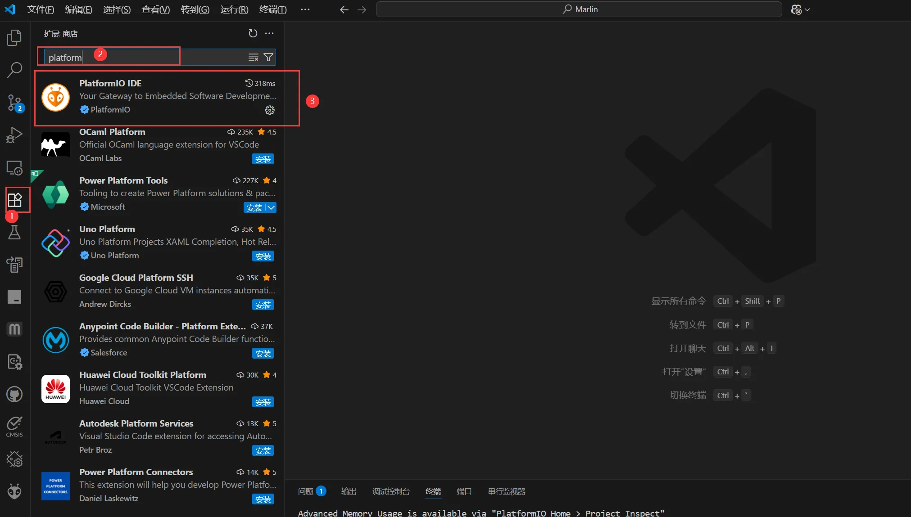
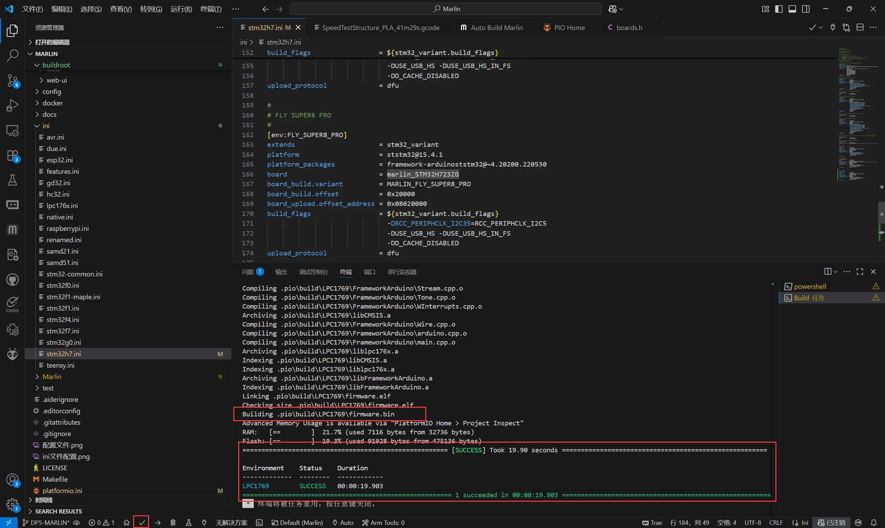
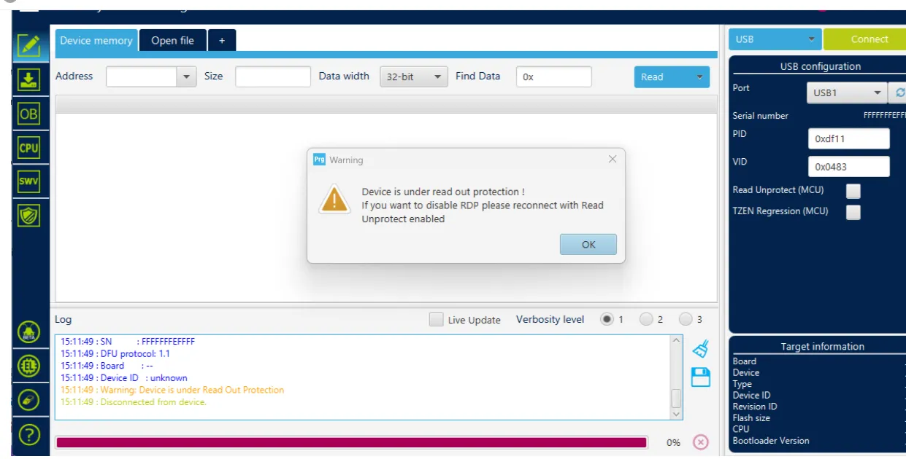
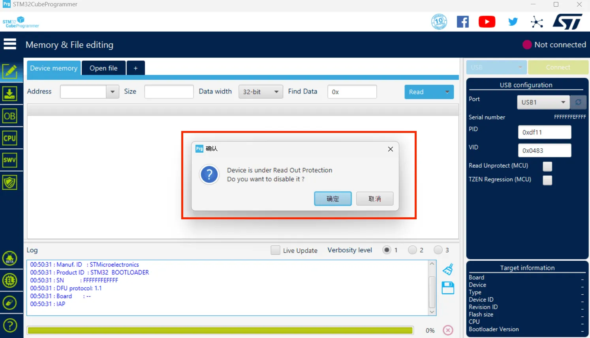
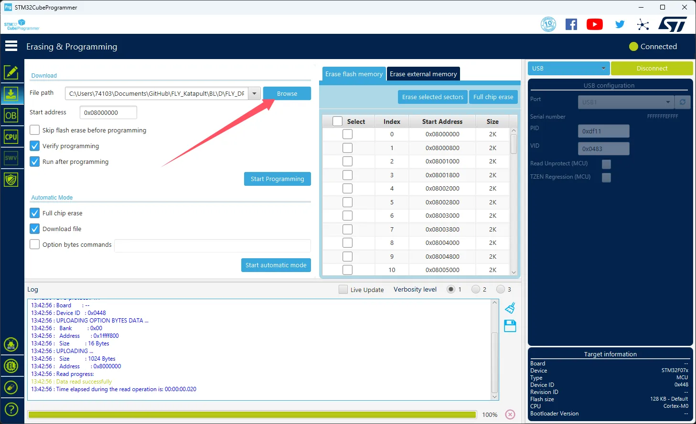
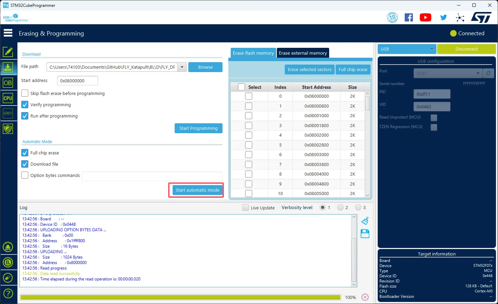

# Marlin Firmware Download

Considerations

```
This is not advised.
```

## Fly\_DP5-Marlin ​

*   [Download](Fly_DP5_MARLIN.zip)

# Marlin Firmware Compilation

> Need to know
> 
> *   This tutorial is based on`Windows`Operation under the system
> *   This tutorial is used`vscode`Please install it in advance.

## Installing the Python environment ​

[Download the Python environment](python-3.13.5-amd64.exe) or [here](https://www.python.org/ftp/python/3.13.5/python-3.13.5-amd64.exe)


Installation completed


## Install the VScode extension (plug-in)​

1.  Open the VScode and open the extension store (button with four squares on the left side of the interface)
2.  Search box input

```
platformIO
```

Find the plugin and install it

Restart vscode



## Firmware address ​

*   After the compilation is successful, the firmware file you need is `firmware.bin`. .
*   It is located in the project directory. `.pio\build\<您的主板型号>\`in the folder.
*   **Path description**::`<您的主板型号>` Replace the specific motherboard model you selected at compile time, for example `D8` or `super8`The directory name is consistent with your compilation environment.



## Burning firmware ​

> Need to know
> 
> In order to ensure the success of STM32 burning, please note the following:
> 
> *   Some computers' **USB interfaces** may cause burn instability due to drive or signal compatibility issues. It is recommended that you **try replacing a different USB port** for connection.
> *   If the replacement port is not valid, an effective solution is to connect **through an external USB docking station**, which often improves compatibility.
> *   When the error message below the burning software report, please also give priority to trying the docking station. If the problem persists, please check or use the machine for burning.
> 
> 

Burning tools

Need to download`SetupSTM32CubeProgrammer`with`STM32 DFU Driver`

Download the firmware to any directory of your computer

Use the Type-C data cable to connect the motherboard to the computer, make sure you're in`dfu`Burning mode

Select USB mode in STM32CubeProgrammer and refresh, connect


If there is no wrong pop-up window, the connection is successful.



Click on the left to download the icon and select a few options below


Click on the arrow.`Browse`Then select the firmware you need to burn.



Select`Start address`Input`0x08000000`

*   Please note that if the firmware is`HEX`Please ignore this step!

Click below.`Start automatic mode`Start burning the firmware



The following prompt indicates that the firmware burning is completed.

```

```