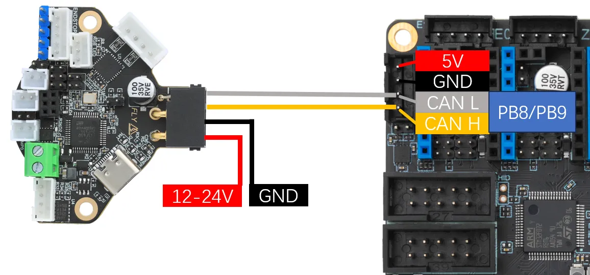
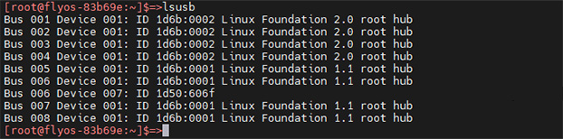
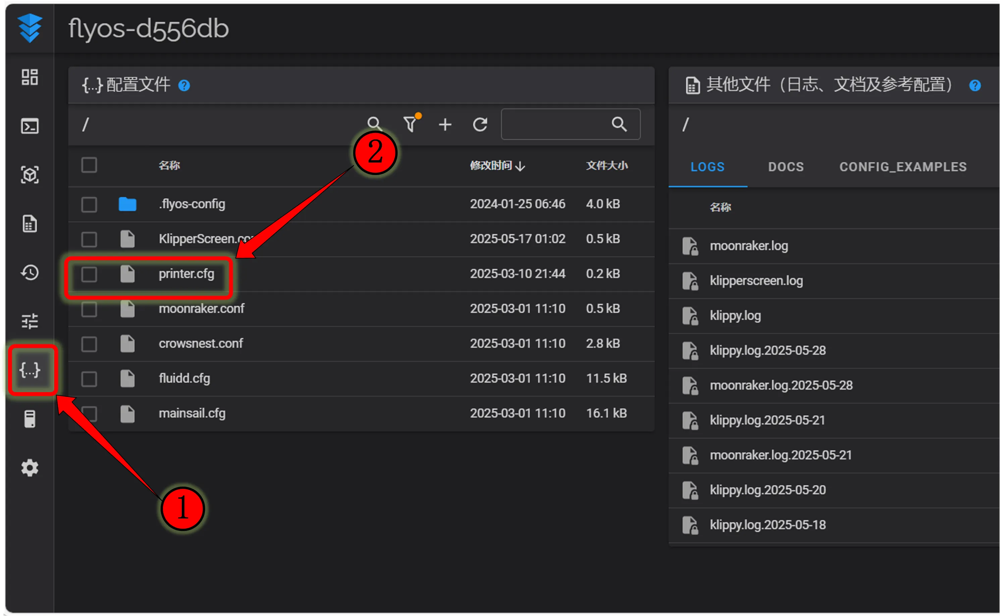

# Important note

> Considerations
> 
> *   This tutorial is dedicated to the wiring and search ID of **the tool board**, the relevant steps do not apply to the motherboard, please pay attention to the distinction.
> *   If you are not using the toolboard, ignore this tutorial.

# Tool board ID read view

*   CANBus UUID
*   CAN reference cable



*   Need to`120Ω`Jumper on


## CAN Toolboard Setup Complete Guide ​

### Preparations ​

> Important Prerequisites
> 
> *   **Toolboard Status** : Make sure the toolboard is brushed in `Klipper-can`Firmware or in `Katapult-can`Model
> *   **Scope** : This tutorial is for **tool board** **ID** search\*\*, not for motherboard\*\* **ID** search
> *   **Connection requirements**The board must be connected to any of the following devices:
>     *   `UTOC`Module
>     *   Brush `USB桥接CAN`Firmware motherboard
> *   **Final connection** : The above devices need to be connected to the host machine

### Hardware Connection and Terminal Resistance Configuration ​

> Safety first.
> 
> *   **Complete power outage** : All wiring must be operated in the event that the equipment is completely powered off
> *   **Prevent short circuits** : Disconnect all devices before operation

#### Connection specification table ​

| Type of equipment | Terminal resistance requirements | Configuration method |
| --- | --- | --- |
| **CAN board** | Needed`120Ω`Terminal resistance | Enabled by a jumper cap or dial switch |
| **Motherboard CAN interface** | Needed`120Ω`Terminal resistance | Enabled by a jumper cap or dial switch |
| **UTOC Modules** | Built-in`120Ω`Resistance | **No** additional connection **required** |

#### Configuration and measurement steps ​

**Hardware configuration**

*   Check the motherboard CAN interface next to`120Ω`Jumper cap or dialing whether to connect or open
*   Check the toolboard.`120Ω`Jumper cap or dialing whether to connect or open

**Resistance measurement** (under power failure)

*   Measuring point: between CAN-H and CAN-L
*   Tools: Multimeter Tables

**Resistance value troubleshooting table ​**

> Considerations
> 
> *   Measurement must be tested in the event of a power failure.
> *   If the measurement range reaches`140Ω`It may be CAN-H and CAN-L.

| Measure of value | Status | Possible reasons | Solutions |
| --- | --- | --- | --- |
| `**60Ω**`**Left and right** | ✅ Normal | The two ends are correctly connected. | Configuration Completed |
| `**120Ω**`**Left and right** | ❌ Unusual | Line disconnected or unconnected | Check all wiring |
| `**40Ω**`**Left and right** | ❌ Unusual | Three-ended connection resistor | Remove the intermediate resistance |

#### Important attention ​

*   **UTOC module** : Built-in resistance, motherboard when connected **No need** to connect terminal resistance
*   **Connecting the scene**::
    *   Tool board ↔ motherboard (terminal resistance is required at both ends)
    *   Toolboard ↔ UTOC ↔ Upper machine (only the tool board requires terminal resistance)
*   **Troubleshooting process**::

```
Measure resistance → 60Ω → Normal use
       ↓
   Outliers → check the table above → retest after adjustment
```

#### Hardware Checklist ​

*    All equipment is completely powered off.
*    The motherboard CAN interface terminal resistor is connected (except UTOC)
*    Toolboard terminal resistor is connected
*    Multimeter measurement resistance value ≈ 60 Ω
*    CAN-H and CAN-L wiring is correct and firm

> Professional advice
> 
> The correct terminal resistor configuration is critical to the quality of CAN bus communication, and resistance value deviation may lead to communication instability or data loss.

### CAN network configuration requirements ​

*   **Default :** This tutorial assumes that the host is configured with CAN network
*   **Fly System Users** : CAN is configured by default if **you** are using **Fly Onhost** and running **Fly-FAST** or **Fly-Armbian** systems (rate 1Mbps)
*   **First use**Please read the following tutorials first: [CAN CONFIG](canconfig.md)

### Summarizing the process ​

1.  **Hardware preparation** : Power off state wiring, configuration terminal resistance, measurement confirmation 60 Ω
2.  **Network confirmation** : Ensure that the host CAN network is configured correctly
3.  **Connecting to the** host: Connecting the host computer via a UTOC or USB bridge motherboard
4.  **Firmware status** : Verify that the toolboard is Klipper-can or Katapult-can mode
5.  **Follow-up** : ID search and configuration by follow-up tutorial

At this point, your CAN board hardware connection and network environment are ready for ID search and configuration operations.

## Connecting with SSH ​

*   Log in to SSH over the network (**Do not log in with serial port**)
*   Ensure that the host is connected to the CAN network device properly

## Search Equipment ​

*   Now you have logged in to the machine normally can enter`lsusb`Search equipment, will be one of the following situations
    *   Input`lsusb`The tip cannot be found.`ls`The instruction can be entered into the following command to install the instruction.

```
sudo apt-get install usbutils
```

*   Input`lsusb`After no reaction, this is a system problem here can not do, you need to replace the system or use to determine the normal system.
*   If the information in the image below appears, please note that this is just a reference. You just have to make sure it shows up.`1d50:606f`Can



*   `1d50:606f`The equipment you need this time.
*   If there are many`1d50:606f`It is necessary to exclude one, otherwise it will affect the subsequent burning and firmware connection, such as`FLY MINI PAD`It is recommended to use on-board.`UTOC`Do not use other **CAN bridging** devices
*   If not, please check whether the data line is connected and whether the firmware is brushed correctly.

> Considerations
> 
> Yes`1d50:606f`Search for CAN ID.

## Search for CAN ID ​

*   Fly-Armbian / Universal System
*   Fly-FAST system

Execute one of the following command to search for CAN device ID:

```
~/klippy-env/bin/python ~/klipper/scripts/canbus_query.py can0

or

python ~/klipper/scripts/canbus_query.py can0
```

### Search results ​

After executing the search command, the following situations may occur:

| The results show | Status statement | Follow-up operations |
| --- | --- | --- |
| `Application: Klipper` | Device has been swiped into Klipper firmware | You can use this ID directly. |
| `Application: CANBOOT`or `Katapult` | The device is in Bootloader mode. | You need to write Klipper firmware before you can use it. |
| `Total 0 uuids found` | No equipment found | Please check the following questions: |
| 1\. Is the CAN network configured correctly? |   |   |
| 2\. Can rate is consistent (1Mbps by default) |   |   |
| 3\. Has the ID been used in the configuration (requires first shielding and then saved to restart) |   |   |


> Repeated ID
> 
> If the device ID is already `printer.cfg`When configured, it does not appear in the search results. To re-search, please:
> 
> 1.  Recomb the device ID in the configuration file
> 2.  Save the configuration and restart Klipper
> 3.  Power off all equipment

## Configuring the CAN Device ID ​

### 1\. Get profile ​

According to the web interface used, `printer.cfg`Profiles:

<table><tbody><tr><td><p><strong>Fluidd</strong>&nbsp;<br>Click on the navigation bar on the left. <code>{...}</code>Illustration, found <code>printer.cfg</code></p><p></p></td><td><p><strong>Mainsail</strong>&nbsp;<br>Click on the top navigation bar. <code>机器</code>, found <code>printer.cfg</code></p><p></p></td></tr></tbody></table>

### 2\. Add equipment configuration ​

In the `printer.cfg`Add toolboard configuration:

```
[mcu toolboard]
canbus_uuid: <Fill in the ID you found>
```

> Configuration Instructions
> 
> *   `toolboard`For the name of the tool board, please modify it according to the actual situation.
> *   If it is a motherboard ID, the configuration segment should be `[mcu]`
> *   In normal configuration, the motherboard is used `[mcu]`Use of toolboards. `[mcu toolboard]`

### 3\. Save and Restart ​

1.  Click **the SAVE & RESTART** button in the upper right corner
2.  The system will automatically save the configuration and restart Klipper.


> Attention
> 
> All IDs that appear in the document are examples, and the IDs of each motherboard are not consistent, please modify them according to the actual obtained ID.