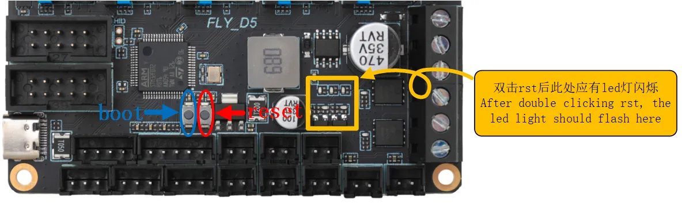
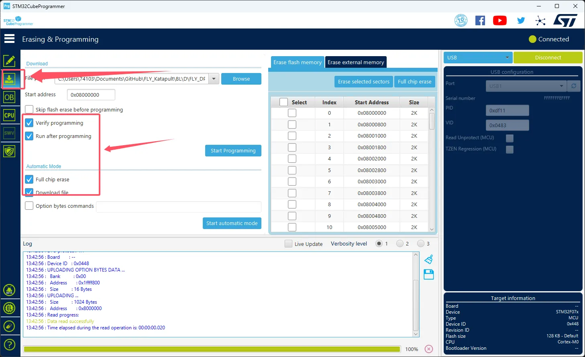
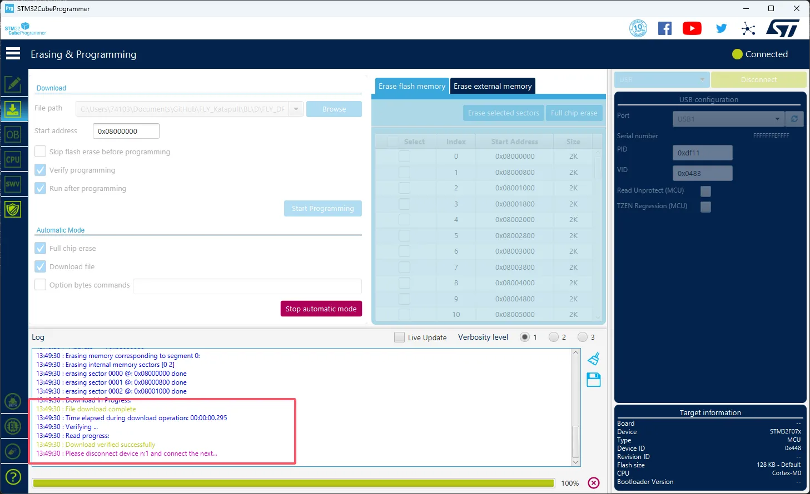
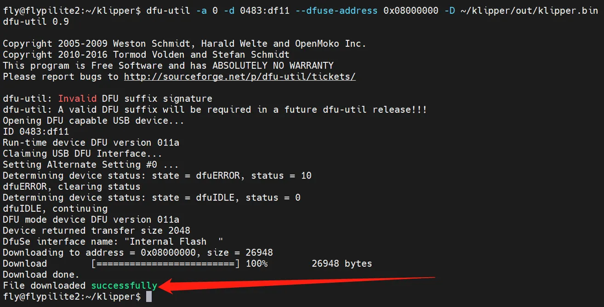

# Katapult Firmware

## Katapult Firmware Description

tip

*   The Fly-DP5 motherboard **can only perform BL flashing via the Type-C USB interface**.
*   It comes pre-installed with the Katapult firmware by default.

## Entering Flash Mode

tip

The left button is the `RST button`, and the right button is the `BOOT button`.

There are two methods to enter flash mode.

First method: With the board completely powered off, hold the BOOT button, then connect a data-capable Type-C cable from the motherboard to your device.

Second method: After connecting a data-capable Type-C cable from the motherboard to your device, hold the BOOT button, then press and release the RST button, and finally release the BOOT button.



## Flashing the Firmware

*   **Windows Flashing Tutorial**
*   Katapult firmware for DP5
    *   [Click the download link](bl.zip)

> Important Notice
> 
> To ensure successful STM32 programming, please pay attention to the following:
> 
> *   Some computer **USB ports** may experience unstable programming due to driver or signal compatibility issues. It is recommended to **try connecting to a different USB port**.
> *   If changing ports does not help, an effective solution is to connect **via an external USB hub**, which often improves compatibility.
> *   When the programming software reports the error message shown below, also try using a hub first. If the issue persists, please check or use the host computer for programming.
> 
> 

Programming Tool

Download `SetupSTM32CubeProgrammer` and the `STM32 DFU Driver`.

Download the firmware to any directory on your computer.

Connect the mainboard to the computer using a Type-C cable. Ensure it has entered `DFU` programming mode.

In STM32CubeProgrammer, select USB mode, refresh, and connect.


If no error pop-up appears, the connection is successful.


Click the download icon on the left and select the options shown below.



Click `Browse` as indicated by the arrow, then select the firmware you need to program.


For `Start address`, enter `0x08000000`.

*   **Note:** If the firmware is in `HEX` format, please skip this step!!

Click `Start automatic mode` below to begin programming the firmware.

```

```

1.  The prompt below indicates that the firmware programming is complete.

```

```

---

*   Host Computer Flashing Tutorial

1.  Install the flashing tool

*   This step is not required for FLY host software.
*   If installation is needed, ensure the host computer is connected to the internet.
*   If the flashing tool has already been installed, you may skip this step.

```
sudo apt update
sudo apt install dfu-util -y
```

1.  Check device connection status

*   Run the following command to confirm whether the device is successfully connected:

```
lsusb
```

*   If the DFU device is not recognized, try re-entering **flashing mode**.
*   In some system versions, the device name might differ; as long as `0483:df11` appears, it indicates the device has successfully entered flashing mode.


1.  Obtain the pre-compiled firmware

*   Below are pre-compiled firmware files. Please choose the corresponding command based on your system type to download (ensure the host computer can access the internet). If download fails due to network issues, please contact the after-sales group administrator for assistance.

---

*   FlyOS-Armbian or Standard System
*   FlyOS-FAST System

```
cd && git clone https://github.com/FengHua741/FLY_Katapult.git

or

git clone https://github.com/FengHua741/FLY_Katapult.git /data/FLY_Katapult 
ln -s /data/FLY_Katapult /root/FLY_Katapult
```

---

*   If you have previously downloaded the firmware package, it is recommended to update to the latest version before proceeding:

```
cd ~/FLY_Katapult && git pull
```

---

1.  Flash the firmware

> tip
> 
> Only one of the firmware files needs to be flashed.

*   Below is the firmware flashing command:

```
sudo dfu-util -a 0 -d 0483:df11 --dfuse-address 0x08000000 -D ~/FLY_Katapult/BL/D/FLY_DP5.bin
```

If the message `File downloaded successfully` appears as indicated by the arrow in the image below, the flashing was successful.



> tip
> 
> After flashing is complete, the motherboard needs to be completely powered off once.