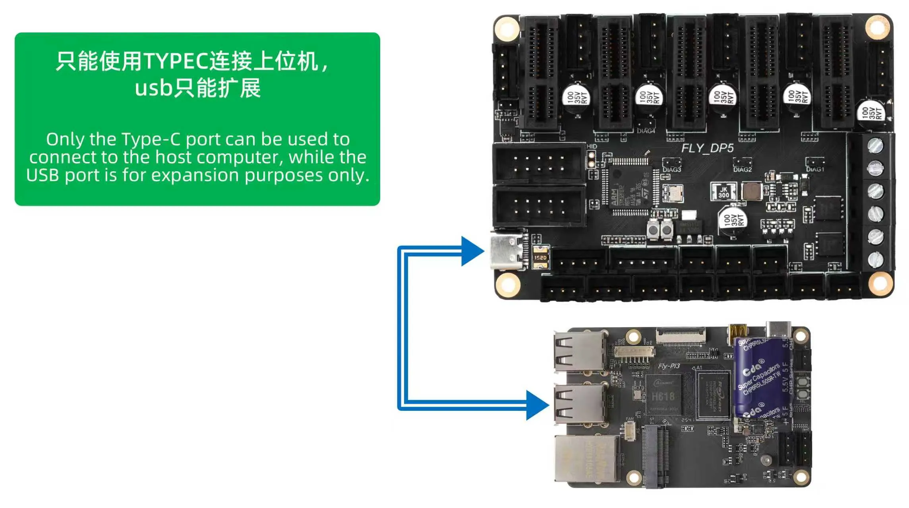
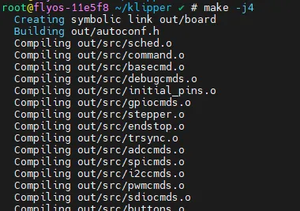
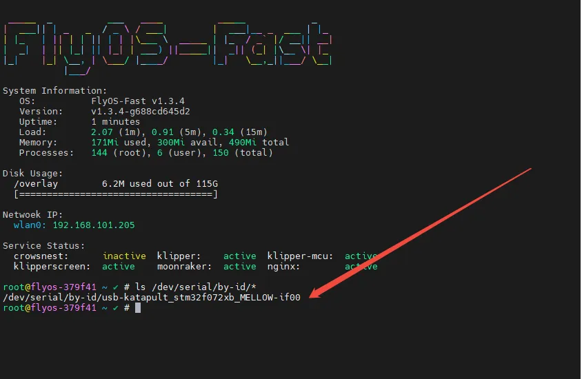
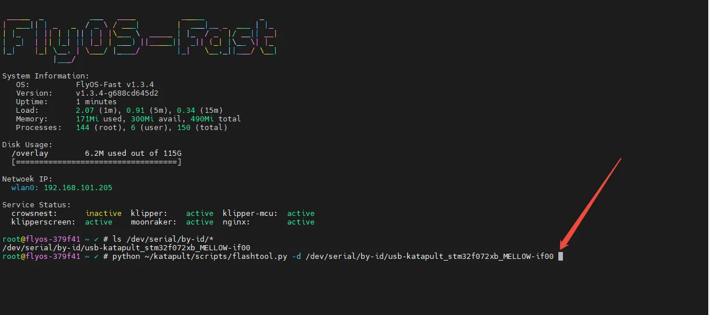
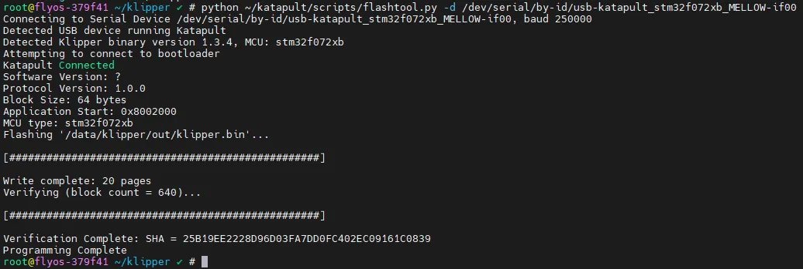
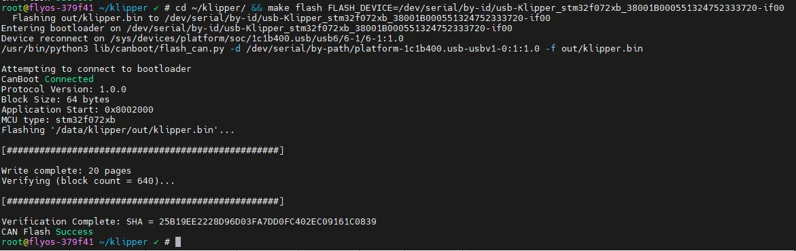

# USB Firmware Compilation

## Connect to the Host Computer

Core Connection Limitation

The Fly-DP5 mainboard **can only communicate with the host computer via the Type-C USB interface** for Klipper.



## Firmware Compilation Notes and Operation Guide

### Important Notes

> 📌 Important Prerequisites
> 
> 1.  **Network Connection**: Ensure the host machine (Raspberry Pi, etc.) is connected to the network.
> 2.  **Access Method**: You must log in to the host machine via **SSH over the network**. Using serial port tools is prohibited.
> 3.  **User Permissions**: Use the correct user account for operations based on the host machine's system type.
> 4.  **Input Method**: Ensure the keyboard input method is set to **Half-width mode (English mode)**.

---

### SSH Login and User Switching

#### **SSH Login to Host Machine**

Use an SSH tool (such as MobaXterm, PuTTY, etc.) to log in to the host machine over the network:

#### Switch User Based on System Type

*   Standard Host Machine (Armbian)
*   FLY Host Machine

**Applicable Systems**:

*   Official Raspberry Pi OS
*   Other systems with Klipper installed

**User Permission Requirements**:

*   **Do not use the** `**root**` **user** for any operations.
*   You must switch to a **standard user** for operations.

**Switch Command**:

Other systems (replace `<username>` with your username)

```
su <username>
```

*   **FLY Host Machine**

**Applicable Systems**:

*   FlyOS-FAST System

**Login Information**:

*   Username: `root`
*   Password: `mellow`

⚠️ Important

The FAST system only has the `root` user.

> 💡 Tip
> 
> Standard users typically have the necessary compilation permissions. Using the root user may cause permission issues.

---

### Firmware Compilation Instructions

#### 1\. Keyboard Operation Guide

*   In the Klipper firmware configuration page, you can only use the following shortcut keys for operation.
*   You cannot use the mouse directly!

| Key | Function Description |
| --- | --- |
| **↑ ↓ Arrow Keys** | Move the cursor up/down to select menu items. |
| **Enter** or **Space** | Confirm selection/check menu items or enter submenus. |
| **ESC** | Return to the previous menu level. |
| **Q** | Exit the Klipper firmware configuration page. |
| **Y** | Press Y to save the configuration if prompted when exiting. |

#### Show Hidden Options

> ⚠️ Show Hidden Options
> 
> If there are few options on the configuration page, first check:
> 
> ```
> [ ] Enable extra low-level configuration options
> ```
> 
> This option is used to display some hidden configuration options.

## Start Firmware Compilation

The following describes how to compile the firmware:

After connecting via SSH, enter the following command and press Enter:

```
cd ~/klipper && rm -rf ~/klipper/.config && rm -rf ~/klipper/out && make menuconfig
```

Among these, `rm -rf ~/klipper/.config && rm -rf ~/klipper/out` deletes previous compilation data and firmware.

`make menuconfig` is for compiling the firmware. After execution, the following interface should appear:


Select **Enable extra low-level configuration options** and press Enter.


Enter the **Micro-controller Architecture** menu, then select **STMicroelectronics STM32** and press Enter.


Enter the **Processor model** menu, select **STM32F072**, and press Enter.


Select **Bootloader offset**, choose: **8KiB bootloader**.


For **Communication interface**, select: **USB (on PA11/PA12)** and press Enter.


**Please compare with the image below to ensure it matches exactly before proceeding to the next step.**


*   Press the `Q` key. When **Save configuration** appears, press the `Y` key.


*   The configuration should now be saved, and you should have exited to the command line interface.
*   Enter the following command to start compilation. This will take some time.

```
make -j4
```



*   The compilation is successful if the following content is output at the end.
*   Due to Klipper version differences, the appearance of `out/klipper.bin` indicates success.

```
Linking out/klipper.elf
Creating bin file out/klipper.bin
```

## Enter Flashing Mode

*   After connecting the mainboard to the host computer using a Type-C data cable, **double-click the RST button**. At this point, the LED on the mainboard will flash.

Warning

*   If the LED does not flash, please re-flash the katapult firmware:
*   If the LED does not flash, after re-flashing the katapult firmware, proceed to the next step.


*   Please ensure that the host machine can connect to the network normally and ensure that the data cable connecting the lower-level machine to the host machine has data transmission function.
*   After SSH connecting to the host machine, input `lsusb` and press Enter. If the information circled in the following picture appears, you can proceed to the next step.
    *   If there is no feedback at all, this is a system problem of the host machine, and we are unable to help. You need to replace with a confirmed normal system or replace the host machine.
    *   If the prompt says there is no `lsusb` command, you can execute the following command to install it:

```
sudo apt-get install usbutils
```


*   `1d50:6177` belongs to the device you will use this time.
    *   Some host machines may not fully display or fail to display due to system problems.
    *   If the `lsusb` command can display the device but does not show `1d50:6177`, please try replacing the data cable and connecting the mainboard to another USB port on the host machine.
*   If you have executed the above steps before and successfully burned the Klipper firmware, and the mainboard is running normally, but you just want to update the Klipper firmware, please directly check the `Firmware Update` section in the right menu bar of this page.

Notice

You must query the `1d50:6177` device before proceeding to the next step.

### Flash Firmware

## Start Flashing

📌 Prerequisites

*   **Internet connection** is required when installing the flashing plugin. Please ensure your host computer is connected to the internet.
*   If the flashing plugin is already installed, there is no need to reinstall it.

### Install Flashing Dependencies

⚠️ Important

If you are using a **non-Fly official host computer**, you must execute the following command to install the firmware flashing dependency package!

*   GitHub Repository
*   Domestic Mirror

```
cd && git clone https://github.com/Arksine/katapult.git
```


---

### Get Board ID

Execute the following command to search for the device ID. Normally, an ID similar to the one shown in the image below should be displayed (**Note: The ID is different for each board**):

```
ls /dev/serial/by-id/*
```



---

### Flash Firmware

⚠️ Preparation

*   Ensure the firmware file has been compiled.
*   Replace `<Your Board ID>` in the command below with the actual ID queried in the previous step.
*   Standard Host
*   Fly Host Flashing Tutorial

```
python ~/katapult/scripts/flashtool.py -d /dev/serial/by-id/<Your Board ID>
```

**Flashing Process Reference:**



**Successful Flashing Reference:**



---

## Firmware Update

*   USB Firmware Update
*   Bridged CAN Firmware Update

### USB Firmware Update Steps

1.  **Query Board ID**

```
ls /dev/serial/by-id/*
```

Identification Key

In the image below, `/dev/serial/by-id/usb-katapult_rp2040_E662549553642032-if00` is the board ID.


1.  **Update Firmware**

```
cd ~/klipper/ && make flash FLASH_DEVICE=<Your Board ID>
```

Note

*   Replace `<Your Board ID>` with the actual queried ID.



---

## Solution for Flashing Wrong Firmware

### Method 1: Quickly Enter Flashing Mode

1.  Power off the board.
2.  After powering on again, **quickly double-click the RESET button**.
3.  Re-enter flashing mode.

### Method 2: Re-flash Katapult Firmware