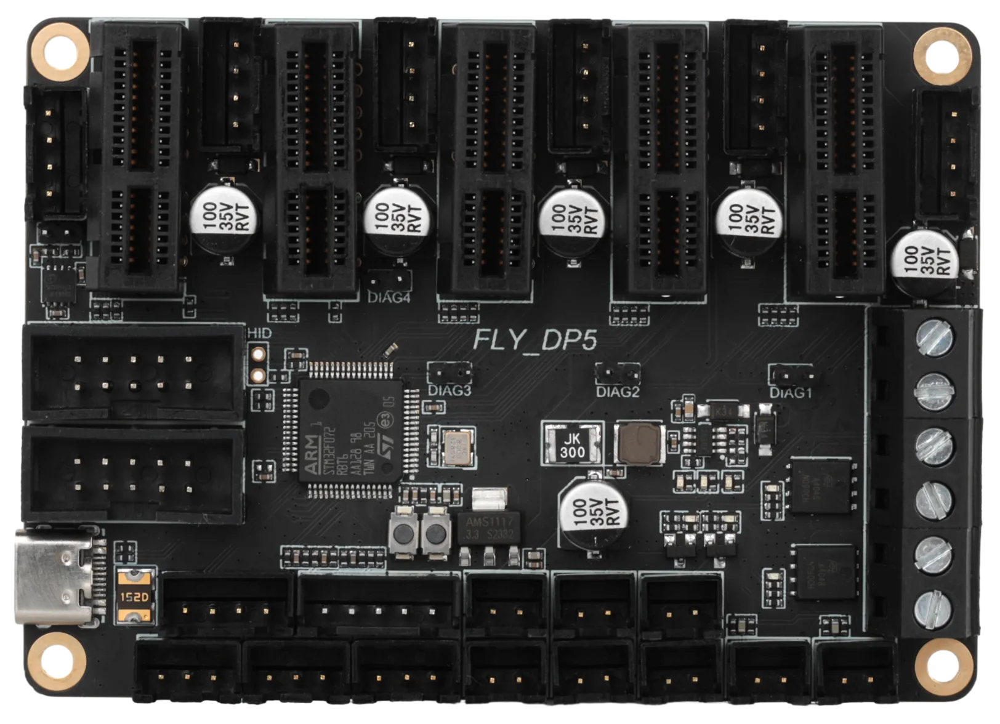

# LY-DP5 motherboard introduction

> Mellow Fly-DP5 is a high-performance 3D printer motherboard introduced by the Fly3D motherboard development team of Guangzhou Magellan Electronic Technology Co., Ltd., supporting up to 5 stepper motors.

> Important tips
> 
> 1.  **Firmware support** : This motherboard supports Klipper and Marlin firmware. If you use Klipper firmware, you need to use it with the host machine.
> 2.  **Power Supply Instruction :** DP5 motherboard **does not support** reverse powering the host via interface.

## Product features ​

*   **Master chip** : STM32F072RBT6 chip with 32-bit ARM Cortex-M0+ architecture, with a frequency of 48MHz.
*   **Communication bus** : CAN bus connection, with stable data transmission, low latency, reliable connection and other advantages.
*   **Driver compatibility:** Supports TP5160, TP22209 and TP2240
*   **Smart Limit :** On-board DIAG function pins can easily return sensors without a physical limit switch via a jumper cap.
*   **Rich interface** : Provides a variety of expansion interfaces such as BLTouch (helf and probe), UART, 12864 LCD screen and so on.
*   **Flexible power supply** : Supports 12-24V wide voltage DC input, stable power supply, eliminating additional buck modules.

## Product Parameters ​

*   **Master MCU** : STM32F072RBT6
*   **Firmware support** : Klipper, Marlin
*   **Input voltage** : DC 12-24V
*   **Driver interface mode** : SPI, UART, STEP/DIR
*   **Compatible drives** : TP5160, TP22209 and TP2240
*   **Temperature** Sensor: 2-way NTC 100K thermistor interface
*   **Heating output** : 2 MOS control interface with high current heating rod
*   **Fan interface**::
    *   2nd line controllable fan
    *   2 Road Parallel Fan Interface
    *   2 road constant open fan interface
*   **Supported** models: Cartesian, Delta, Kossel, Ultimaker, CoreXY, etc.

## Electrical Specifications (Maximum Continuous Current) ​

| Output port | Maximum current at 24V power supply | Maximum current at 12V power supply |
| --- | --- | --- |
| Heat rod port | 6A | 3A |
| Fan port | 1A | 0.5A |

*   Please ensure that the power supply voltage and current meet the above requirements to avoid overload.
*   Before connecting the power supply, reconfirm the polarity to prevent reverse connection.