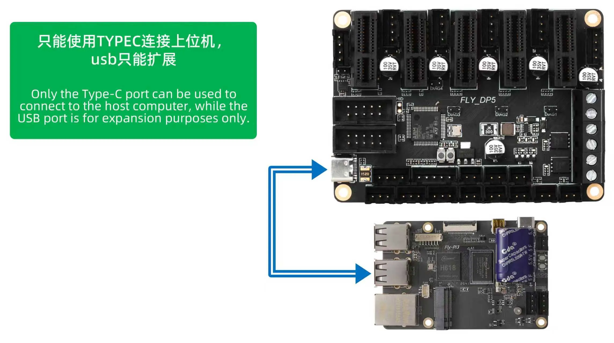

# Main Board Frequently Asked Questions

## **Host connection instructions**

> Core connectivity restrictions
> 
> The Fly-DP5 motherboard **must** establish Klipper communication with the host **via its Type-C USB interface.**

**Connection** requirements:

*   Use **high-quality Type-C data lines** to ensure data transmission stability.
*   It is recommended that the length of the data line should not exceed 1.5 meters, so as to avoid using long cables.
*   Connect the other end of the cable to the standard USB-A interface of the host.

---

## **Frequently Asked Questions and Inspections**

### Question 1: The host does not recognize the DP5 motherboard ​

**Check the** steps:

1.  **Check the physical connection** : Make sure to connect using the Type-C interface on the motherboard.
2.  **Verify the firmware** : Check that the motherboard has correctly swiped into the Klipper firmware.

### Question 2: The back power supply instructions for the motherboard up to the local level ​

**Causes of the problem**   
It is forbidden to connect the 5V power pin of the motherboard (such as the 5V of the limit interface) to the 5V power supply pin of the host computer (such as the Raspberry Pi). This connection can lead to power conflicts.

**Important warning**

*   **Such connections** are **strictly prohibited**, otherwise it may damage the USB interface and power circuit of the motherboard or the host computer.
*   Communication between the motherboard and the host **computer should only be made through a USB data cable** and no other electrical connection should be established.

**The correct way to deal with it**

1.  Check and remove all 5V cables between the motherboard and the host except the USB data line.
2.  Make sure the host (such as the Raspberry Pi) is powered by its independent power adapter.