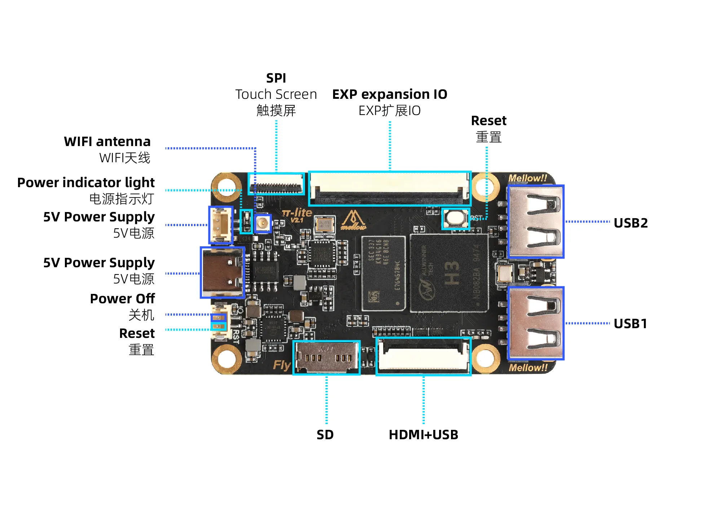
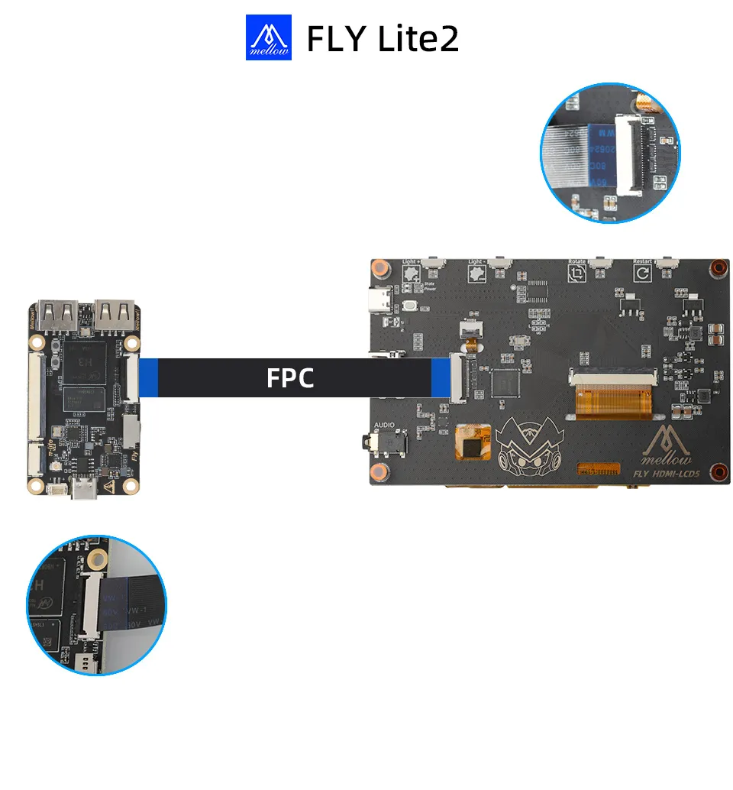
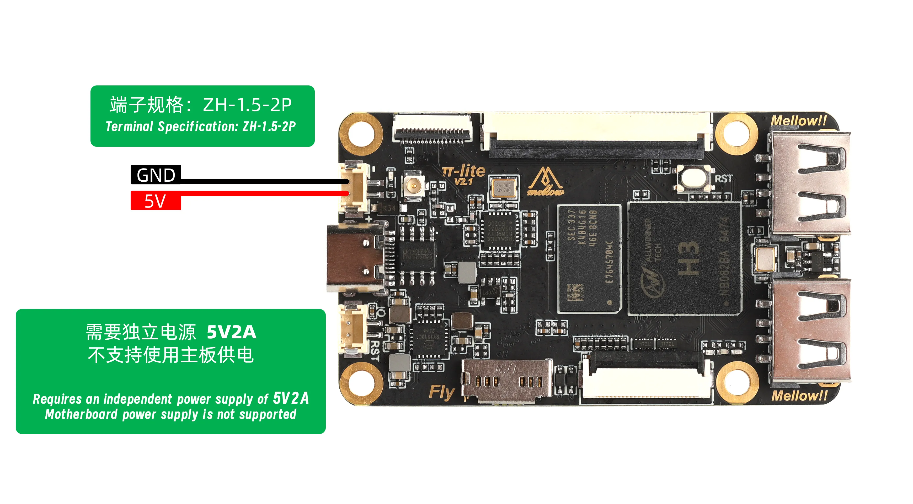
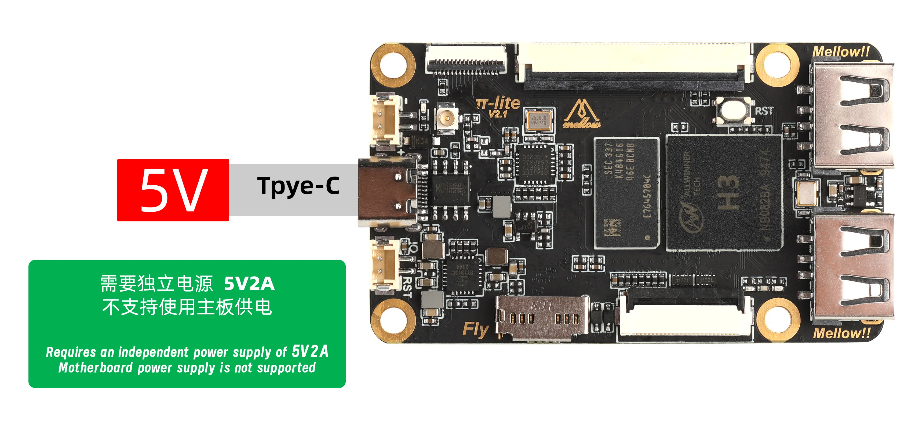

# Fly-Pi-lite2.1

Fly-Pi-lite2.1 is a Klipper machine for beginners, integrated with deeply optimized systems and plug-ins, out of the box, to help users quickly build a 3D printing control environment.

## Product features

* **Processor** : All-in-One H3 Quad-core Cortex-A7
* **Graphics:** Mali-400 MP2
* **Running memory:** 512MB DDR3
* **Storage extension** : Supports up to 128GB Micro SD card (TF card)
* **Wireless** network: 2.4GHz Wi-Fi on board
* **Peripheral interface**::
  * USB 2.0 to 2
  * FPC-TFT × 1 or FPC-HDMI × 1
* **Extended interface** : Reserved FPC interface with HDMI + USB first-line pass
* **Pre-installed System**: Comes pre-installed with Klipper, Moonraker, Mainsail/Fluidd, KlipperScreen, resonance compensation plugins, NumPy, etc. No need to change sources, simplifying the deployment process (requires your own TF card).

## Core highlights

**Deep Optimization, Performance Boost** Equipped with the Allwinner H3 quad-core processor, running **deeply customized FlyOS & Klipper firmware**, offering significant optimization in command processing and printing performance compared to the native version.

**Ready to Use, Complete Ecosystem** Pre-installed with all essential plugins and components, eliminating complex debugging and greatly reducing the time from installation to the first print.

**One-Click Updates, OTA Support** Supports Over-The-Air (OTA) system updates, no need to re-flash firmware, allowing continuous access to the latest features and security patches.

## Purchase and Usage Notes

> Storage
>
> * Fly-Pi-lite2.1 **does not come with storage devices** and must prepare your own memory card to use:
> * The Fly-Pi-lite series must be used with a **TF card**, otherwise the system will not boot.
> * It is recommended to use a **16GB–128GB** capacity Micro SD (TF) card with a speed rating of C10 and above.

> Electricity
>
> * **Fly-Pi-lite2.1 does not support powering it via an MCU (3d printer mainboard).**
> * The Fly-Pi-Lite2.1 must be powered by a separate 5V power adapter, otherwise it may cause device damage or work abnormally. Suggest [FLY-KPPM](/FLY-KPPM) module.
> * Input voltage range is **5V**. Do not exceed this range.
> * **Safe Operation**: **Always disconnect power before performing any wiring operations!** Also, follow the guide's instructions when flashing firmware.

> WIFI
>
> * Fly-Pi-lite2.1 only supports 2.4GHz Wi-Fi networks and does not support 5GHz or dual-band integrated networks.

## The motherboard interface description

The following figure shows the layout of the main board interfaces, which can be quickly referenced:

## Installing the Antenna

1. Install the Wi-Fi antenna.

> Please note: The Pi-lite does not support Wi-Fi with Chinese names or dual-band (2.4G and 5G) combined Wi-Fi.

* The location indicated by the red arrow is the Wi-Fi antenna interface.
* The Wi-Fi antenna port is`ipex1`.
* Install the antenna onto the M2WE; otherwise, poor signal may prevent connection to the router.

  

## _Screen Wiring and Configuration_

> Safety Notice
>
> * When connecting TFT or HDMI screens using FPC cables, **ensure the device is completely powered off** to prevent screen damage.
> * When wiring TFT screens, confirm the insertion direction of the FPC cable to **avoid reverse connection causing device failure.**

> **IMPORTANT**
>
> * The TFT screen package includes two FPC cables: `14P (narrow cable)` and `16P (wide cable)`.
> * For `lite2.1`, you **must** use the `16P (wide cable)`.
> * Ensure the DIP switch on the back of the screen is correctly set: `Resi` for resistive screens, `Cap` for capacitive screens.

Screen Types:

## TFT Screen Configuration

### FLYOS-FAST System Screen Configuration

1\. Access the device IP address via a browser, e.g., `http://192.168.6.110/`

| `fluid` interface operation: Uncheck "Filter hidden files and folders" | `mainsail` interface operation: Check "Show hidden files" |
| ------------------------------------------------------------------------ | :---------------------------------------------------------- |
|                                                       |                                          |

2\. Enter the displayed `.flyos-config` folder and locate the `sys-config.conf` configuration file.

3\. Edit the `sys-config.conf` file and modify the corresponding configuration item based on the screen type.

| TFT**Resistive** Screen                          | TFT**Capacitive** Screen                         | **HDMI** Screen                          |
| -------------------------------------------------- | -------------------------------------------------- | ------------------------------------------ |
| Change the text after`screen=` to `fly-tft-v2-r` | Change the text after`screen=` to `fly-tft-v2-c` | Change the text after`screen=` to `hdmi` |
| `screen=fly-tft-v2-r`                            | `screen=fly-tft-v2-c`                            | `screen=hdmi`                            |

4. Also need to modify:

* Change `klipper_screen=0` to `klipper_screen=1`

**Example:**

> Configuration Notes
>
> * Ensure the DIP switch on the back of the screen is correctly set: `Resi` for resistive screens, `Cap` for capacitive screens.
> * The configuration file format must be `key=value`. There must be **no space** after the equals sign.
> * Do not modify the configuration file format arbitrarily, otherwise the configuration will not take effect.

4\.  After saving the configuration, restart the system for the changes to take effect.

## Storage Requirements

> Important
>
> The LITE series **does not include storage devices** and requires a Micro SD (TF) card to boot the system.

**Capacity Requirements** : Micro SD cards from **16GB to 128GB** are recommended.

**Speed Requirements** : Memory Card Speed Requires `C10` Above

> The easiest way to identify a Class 10 SD card is to look for a speed class symbol printed directly on the card itself or on the packaging. There are a few different symbols to look for:
>
> * C10 – This stands for Class 10 and indicates a minimum sustained write speed of 10 MB/s.
> * U1 – This indicates a minimum sustained write speed of 10 MB/s and a minimum read speed of 40 MB/s. U1 cards meet the Class 10 specification.
> * U3 – This indicates a higher performance card with a minimum sustained write speed of 30 MB/s and a minimum read speed of 40 MB/s. U3 cards are better than Class 10 cards.

## Systems and software

* **Operating system** : FlyOS-FAST (lightweight system optimized for 3D printing)
* **Core firmware**::
  * **Deeply optimized Klipper firmware**, motion planning and instruction handling performance improvements
  * RRF ([RepRapFirmware](https://docs.duet3d.com/User_manual/RepRapFirmware/RepRapFirmware_overview))
* **Pre-installed software**::
  * Core components: Klipper, Moonraker
  * Web interface: Mainsail / Fluidd (default Fluidd)
  * Plugins and functions: KlipperScreen, Crowsnest (camera), input shaping, resonance compensation, etc. (NumPy is pre-installed)

> * Ensure the TF card or M2WE is correctly formatted before flashing the image.
> * The first system boot may take 3-5 minutes; please be patient.
> * Default SSH login: username: root, password: mellow.
> * Screen configuration is only necessary if you have a screen device.

# FlyOS-Fast System Introduction

## Overview

FlyOS-Fast is a lightweight Linux system specially optimized for 3D
printing, providing a stable and efficient operating environment for the
full Fly series of host platforms.

## Core Features

### 🏗️ System Architecture

* **Single-user Mode** : Minimalist design, supports only the`root` user, ensuring system security and stability
* **File System Optimization** : Only the`/etc` and`/data` directories are writable, core directories are read-only, significantly reducing the risk of power failure damage
* **Fast Boot** : Optimized boot process, KlipperScreen starts within 30 seconds

### 📦 Software Ecosystem

* **Fully Pre-installed Ecosystem** : Mainstream services such as Klipper, RRF, Mainsail, Fluidd, Moonraker, and KlipperScreen are built-in
* **Streamlined Package Management** : Traditional package managers removed, necessary tools pre-installed, maintaining a lightweight system
* **Environment Optimization** : Global Python environment simplifies plugin installation and command execution

### ⚡ Functional Features

| Feature Category         | Description                                                    | Notes                                                        |
| -------------------------- | ---------------------------------------------------------------- | -------------------------------------------------------------- |
| **System Switching**     | Supports dual system switching between Klipper and RRF         | Meets different printing needs                               |
| **Interface Management** | One-click switching between Mainsail and Fluidd web interfaces | Easy to operate                                              |
| **Power Management**     | Power-off shutdown and power-loss resume printing functions    | Configurable one at a time, cannot be enabled simultaneously |
| **Data Management**      | USB configuration file backup + OTA system updates             | Dual protection                                              |
| **Display Support**      | Fly-WiScreen serial display                                    | Stable and reliable                                          |
| **Firmware Management**  | Automatic firmware flashing on boot                            | Supports devices like fly-c8, fly-c5, fly-c8p                |
| **Personalization**      | Preset UI language and default printer name                    | Ready to use out of the box                                  |

## System Version Compatibility

> Version Selection Tip
>
> * Please choose the corresponding system version based on your device's chip model
> * It is recommended to always use the latest version for optimal performance and features
> * The`v1.3.XX` in the version number represents different minor versions based on the 1.3 series

| System Version              | Chip Platform  | Compatible Devices                              |
| ----------------------------- | ---------------- | ------------------------------------------------- |
| **FlyOS-Fast-H618-v1.3.XX** | Allwinner H618 | fly-C5, fly-C8P, fly-PI-V3                      |
| **FlyOS-Fast-H5-v1.3.XX**   | Allwinner H5   | fly-pi series, fly-c8 series, fly-gemini series |
| **FlyOS-Fast-H3-v1.3.XX**   | Allwinner H3   | fly-pi-lite2 series, fly-miniPad                |

## System Features and Design Overview

### 1. System User Description

* FAST adopts a single-user mode to achieve extreme lightweight and security.
* **Only User** :`root`
* **Restriction** : The system does not support creating or switching to other user accounts.

### 2. Package Management

* To maintain its lightweight and fast-boot characteristics, the`FAST` system does not include traditional package managers such as`apt`, and therefore commands like`apt update` cannot be executed.
* **Pre-installed Software** : The system comes preloaded with the Klipper ecosystem and commonly used tools for daily maintenance.
* **Additional Software Needs** : If you require
  additional packages, please let us know. We will evaluate their general
  applicability and consider pre-installing them in future releases.

### 3. File System and Persistence

* **Writable Paths** : To ensure the integrity of the core system, the FAST system**only allows modifications** to files under the`/etc` and`/data` directories.
* **Restriction Notice** : All other directories
  in the system are read-only, and any changes made will not be preserved.
  Please store your custom configurations and data within the two
  designated directories mentioned above.

### 4. System Update Policy

The FAST system supports two update methods:

#### OTA Online Update (Recommended)

* Starting from`V1.3.0`, the`FAST` system supports`OTA` upgrades.
* **Update Entry Point** : You can access the system's OTA upgrade page by visiting the host computer's**`IP address:9998`** .
* **Important Notes** :
  * Before initiating a system update, please ensure that**all printing tasks are paused** .
  * During the update process, system services will restart.**Do not perform any printing operations** , as this may lead to print failures or hardware malfunctions.

#### Firmware Update (Reflash)

* **Applicable Scenario** : When the system fails to boot normally.
* **Important Warning** :

  * **Backup Configuration Before Flashing** : The flashing process will erase all user data. Please ensure you back up your printer system configuration in advance.
  * After flashing, you will need to manually restore the backed-up configuration files.
* **Flashing Method** : Please refer to the official flashing tutorial and tools provided.

## Installing the System Storage Card

* Ensure that the system card has the corresponding system flashed onto it; otherwise, it will not boot.
  

## Power connection requirements

* **Type-C Power Supply** : Requires a power adapter with **output** of **5V/2A and above**.
* **Terminal power supply**: adopted `ZH-1.5-2P` The terminal is connected to an external 5V DC power supply.

> The LITE series **does not support** power via mainboard and must be powered by a separate power supply.

* **Safe Power off protection function**::
  * Requires the [KPPM security shutdown module.](/FLY-KPPM)
    _This function needs to be configured within the system to enable; it is disabled by default._

### The Fly-Pi-lite2 series supports the following two power supply methods.

#### 1\. Power Supply via 5V DC Power Source

* Please use the dedicated power terminal to connect the DC power source. The voltage is **5V/2A**.
* **Please note**: The `LITE series` does not support power supply through the mainboard.
* The power connector model is `ZH-1.5-2P`.
* Please refer to the following diagram for the wiring method:

#### 2\. Power Supply via Type-C Interface

* Power can be supplied directly through the Type-C interface.
* It is recommended to use a power adapter with an **output of at least 5V/2A**.
* The wiring diagram is as follows:

* After the system boots, the indicator light will blink rapidly!!
* Blinking indicates that the system has started.
