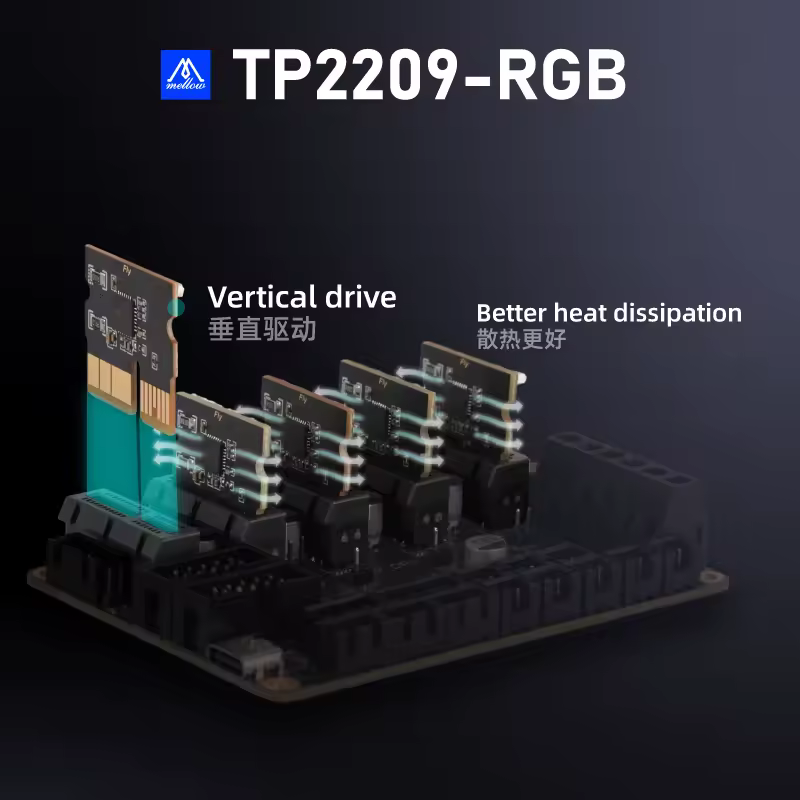
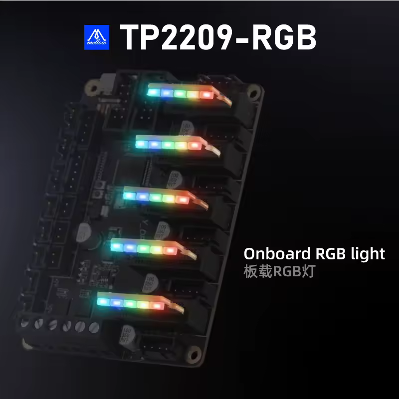

# Mellow Fly-DP5 Control Board

### 32-bit ARM Chip, PCIe,RGB Driver,CAN Bus,DIAG Homing, and Klipper Support For DIY 3D Printer Parts

<table><tbody><tr><td><figure class="image"></figure></td><td>$26.87</td></tr><tr><td></td><td>$60.19</td></tr><tr><td><figure class="image"></figure></td><td>$47.29</td></tr></tbody></table>

# Product sellpoints

*   DIAG Homing:Includes an onboard DIAG feature pin for easy plug-and-play infinite homing support.
*   Universal Structure Support:Supports a wide range of 3D printer setups, including Cartesian, Delta, Kossel, Ultimaker, and CoreXY.
*   RGB Driver Support:Compatible with drivers like TP2209-RGB and TP5160-rgb, offering versatile RGB lighting control.
*   Melwin|Maxpush Board|32-bit ARM Chip:Equipped with a 32-bit ARM Cortex-M0+ series STM32F072RBT6 main control chip, ensuring high-speed processing at 48MHz.
*   PCIe Slot:Features a PCIe slot designed to prevent reverse insertion, enhancing stability and reliability.

## Specifications

<table><tbody><tr><td>High-concerned chemical</td><td>None</td><td>Model Number</td><td>20FDP5V1B</td></tr><tr><td>Item Type</td><td>Motherboard</td><td>Brand Name</td><td>Mellow</td></tr><tr><td>Origin</td><td>Mainland China</td><td>Firmware</td><td>Klipper</td></tr><tr><td>Driver support</td><td>TP2209 &amp; TP5160, etc.</td><td>Input voltage</td><td>DC12V-DC24V</td></tr><tr><td>Motor driver interface</td><td>X Y Z E0 E1</td><td>&nbsp;</td><td>&nbsp;</td></tr></tbody></table>

## Images

  
  
  
  
  
