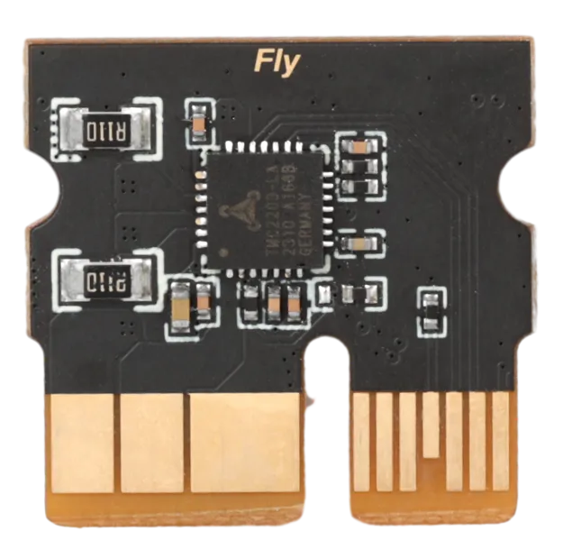

# TP 2209



## Basic parameters ​

*   Input voltage: 12V-24V
*   Applies to: Marlin/Klipper/RRF Firmware
*   The motor is not easy to lose.
*   Supports silent mode
*   Large area fan hot pads to reduce drive operating temperature
*   Drive mode support: TMC: UART
*   Support motor blockage detection

## FLY motherboard jumper ​

> Prompt
> 
> *   TP2209 uses UART mode
> *   TP2092 does not need to drive the jumper cap, only just configuration

## TP2209 Reference Configuration ​

> Dangerous
> 
> The driver sampling resistance is 0.110 please do not set the error

```
[tmc2209 stepper_x]
uart_pin: 
interpolate: False
run_current: 0.8                    # Operating current
sense_resistor: 0.110               # Do not change the drive sampling resistance
stealthchop_threshold: 0
```

## Infinite bit usage instructions ​

> Infinite bit usage tips
> 
> *   Infinite bit use requires a limit, the normal situation is the first driver bit using IO1, the second driver using IO2 and so on.
> *   Use unlimited bits to pay attention, please do not access anything at the corresponding limit port
> *   The FLY part of the motherboard is a direct connection driver port, please note whether the DIAG is directly connected to the corresponding pin.

> Infinite bit usage tips
> 
> *   The original`endstop_pin:`Need to be blocked or deleted, in addition`endstop_pin: tmc2209_stepper_x:virtual_endstop`
> *   Configuration`diag_pin:`After refreshing the limit state is not triggered
> *   Configuration`driver_SGTHRS:`You need to test the appropriate value yourself.
> *   Reference configuration

```
[stepper_x]
# endstop_pin:
endstop_pin: tmc2209_stepper_x:virtual_endstop
homing_retract_dist: 0        # Fallback without changing to 0 may cause homing failure

[tmc2209 stepper_x]
diag_pin: ^
driver_SGTHRS: 100
```